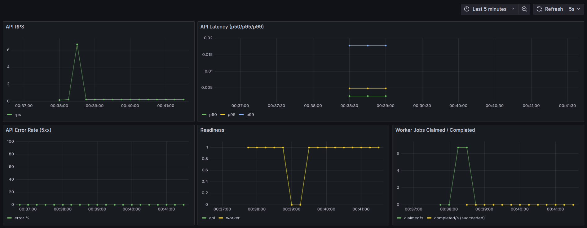
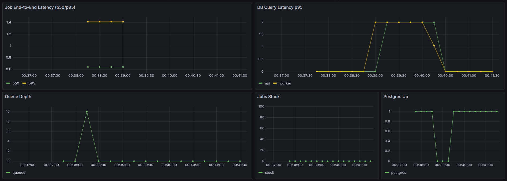

# Observability-First Image Thumbnailer

Reference architecture for a small service that I actually want to be able to debug
in production. An API accepts image uploads, a worker resizes them with sharp, and
everything talks to Postgres. The interesting part is the observability layer:
OpenTelemetry traces flow through a collector into Jaeger, Prometheus scrapes both
services, and a pre-built Grafana dashboard ties it all together.

The demo script simulates a DB-down incident so you can watch the alerts fire,
the queue back up, and everything recover — then replay the exact same traffic
pattern later.




## Quickstart

```bash
docker compose up -d --build
```

- Grafana: http://localhost:3000 (admin/admin)
- Prometheus: http://localhost:9090
- Jaeger: http://localhost:16686

## Demo

```bash
npm run demo
```

Sends 100 requests, pauses Postgres for 45s mid-flight, then recovers.
The run is saved to `demo_runs/run.json` and can be replayed:

```bash
npm run loadgen -- --replay demo_runs/run.json
```

## API

| Endpoint | Purpose |
|---|---|
| `POST /v1/thumbnails` | Multipart image upload. Returns `202` with a `job_id`. |
| `GET /v1/jobs/:id` | Job status + output URLs when done. |
| `GET /v1/thumbnails/:id/:size` | Download a generated thumbnail. |
| `GET /healthz` / `GET /readyz` | Health & readiness probes. |
| `GET /metrics` | Prometheus scrape endpoint. |

## SLOs

- API enqueue latency: 99th percentile under 300ms
- End-to-end job completion: p95 under 5s

See `docker/prometheus/alerts.yml` for the error-budget-style alert rules,
and `docs/runbook.md` for the incident response playbook.

## Tests

```bash
npm test                # unit tests (vitest)
npm run test:integration  # spins up stack, sends 1 request
npm run test:chaos        # stops postgres, verifies 503 + recovery
```

## Known Limitations

- No auth — everything trusts `X-Tenant-Id` header
- Single worker instance (no horizontal scaling yet)
- Local disk storage only (no S3/GCS)
- JPEG output only — no WebP or AVIF
- No rate limiting on the API
